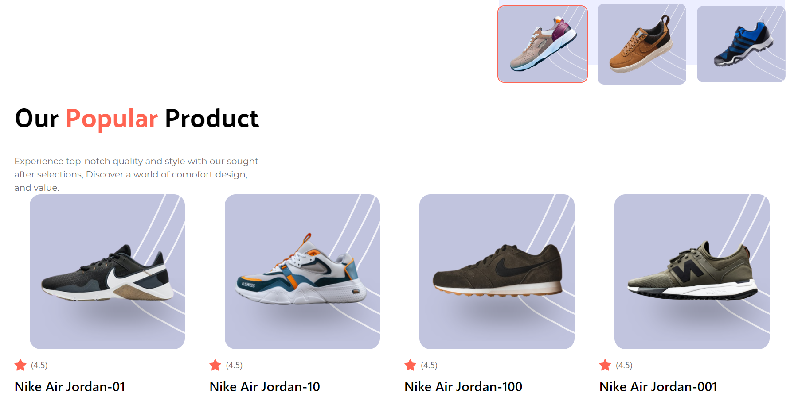
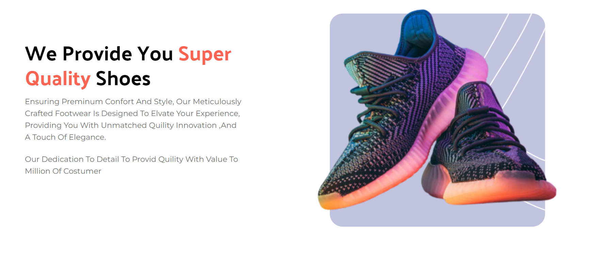
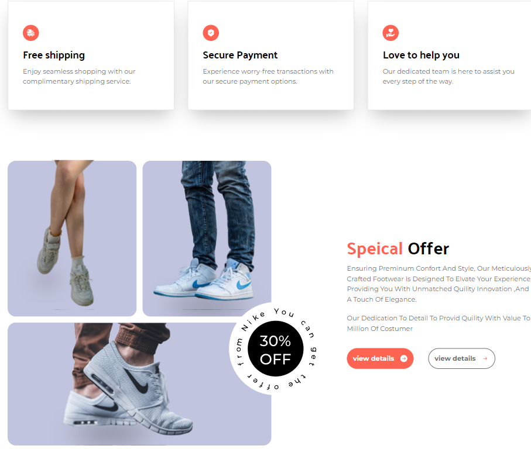
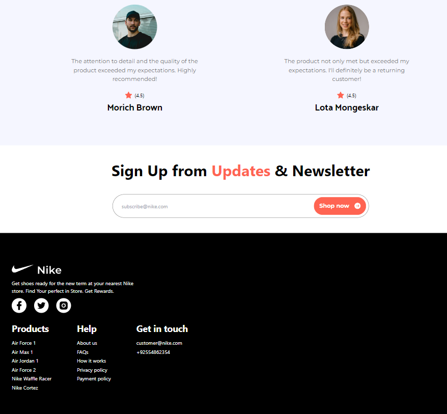

## 📋 <a name="table">Table of Contents</a>

1. 🤖 [Introduction](#introduction)
2. ⚙️ [Tech Stack](#tech-stack)
3. 🔋 [Features](#features)
4. 🤸 [Quick Start](#quick-start)

## 🚨 Tutorial

This repository contains the code corresponding to an in-depth tutorial available on our YouTube channel, <a href="https://www.youtube.com/@javascriptmastery/videos" target="_blank"><b>JavaScript Mastery</b></a>.

If you prefer visual learning, this is the perfect resource for you to learning taillwind and reactjs projects like these step-by-step in a beginner-friendly manner!

## <a name="introduction">🤖 Introduction</a>


Master Tailwind CSS in two parts by first learning fundamentals, advanced techniques, and theming. Then, build a stunning Nike landing page, applying learned skills to create a visually impressive website.

👉 ❤️superquility section

👉 ❤️ sepcial offer section

👉 ❤️ review and footer section



## <a name="tech-stack">⚙️ Tech Stack</a>

- Tailwind CSS
- React.js

## <a name="features">🔋 Features</a>

👉 **Maximizing Tailwind CSS**: Discover tips and tricks to make the most out of Tailwind CSS.

👉 **Understanding Tailwind Internals**: Dive into the inner workings of Tailwind, gaining insights into its structure and optimizations.

👉 **Best Practices**: Learn Tailwind's best practices for efficient and maintainable code.

👉 **Theming**:Explore techniques to add different themes to your website using Tailwind CSS.

👉 **JavaScript-like Tasks with Tailwind**: Discover how Tailwind CSS can be used to achieve tasks that typically require JavaScript code

while building a beautiful Nike Website with a,

👉 **Complex Hero Section**: A visually appealing hero section showcasing key elements.

👉 **Popular Products Showcase**: A section highlighting popular Nike products

👉 **About Us Section**: An informative "About Us" section with a unique design.

👉 **Special Offers**: Showcase special offers in an eye-catching manner

👉 **Testimonials**: A testimonials section for a captivating user experience

👉 **Newsletter Integration**: A newsletter section with Tailwind styling, encouraging user engagement

👉 **Footer**: A comprehensive footer section containing various links

👉 **Mobile Responsive**: The entire website is responsive across various devices, emphasizing Tailwind's mobile-friendly capabilities.

and many more, including code architecture and reusability

## <a name="quick-start">🤸 Quick Start</a>

Follow these steps to set up the project locally on your machine.

**Prerequisites**

Make sure you have the following installed on your machine:

- [Git](https://git-scm.com/)
- [Node.js](https://nodejs.org/en)
- [npm](https://www.npmjs.com/) (Node Package Manager)

**Cloning the Repository**

```bash
git clone https://github.com/adrianhajdin/nike_landing_page.git
cd nike_landing_page
```

**Installation**

Install the project dependencies using npm:

```bash
npm install
```

**Running the Project**

```bash
npm start
```

Open [http://localhost:5173](http://localhost:5173) in your browser to view the project.
